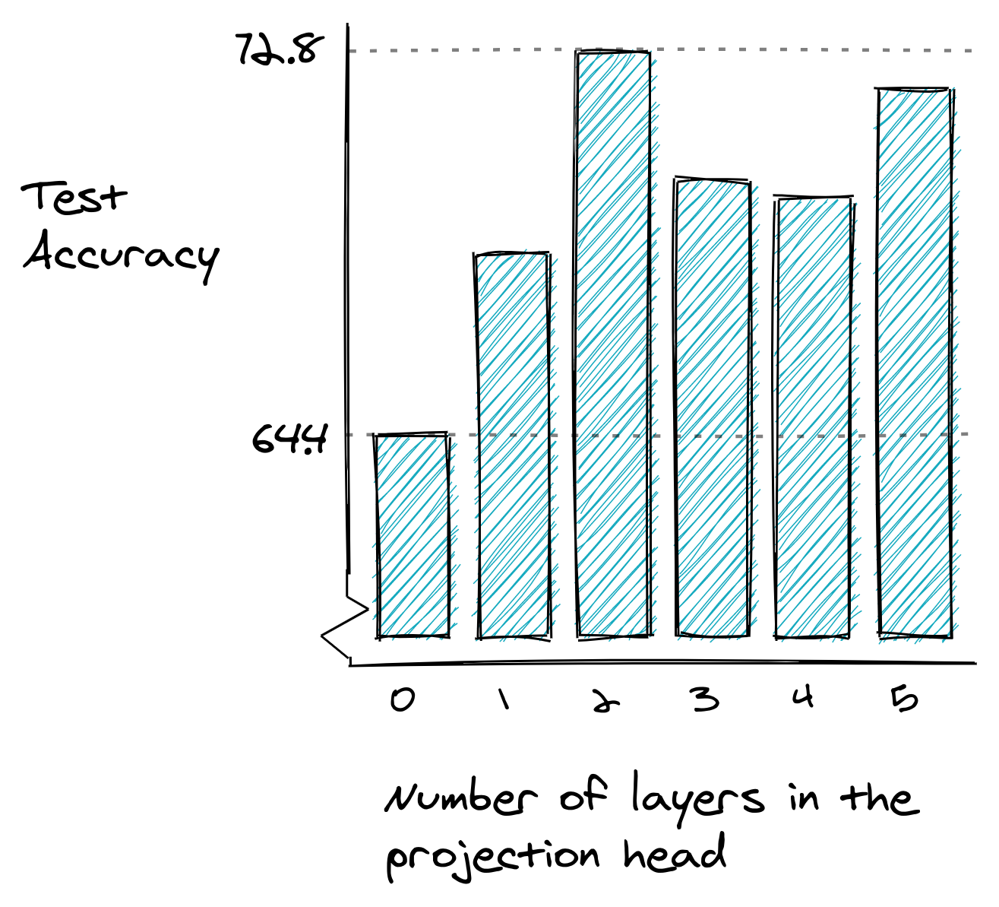

# SimCLR: A Simple Framework for Contrastive Learning of Visual Representations in PyTorch
Arxiv link for the SimCLR paper : [A Simple Framework for Contrastive Learning of Visual Representations][1]  


Introduction
---
This repository contains my implementation of the SimCLR paper in PyTorch. I've written a blog post about the same [here][2]. SimCLR presented a simple framework to learn representations from unlabeled image data using contrastive learning. A composition of two data augmentation operations, namely random crop and color jittering, produced outlooks from images, and then positive and negative pairs are defined as outlooks from same and different images, respectively, in a batch.


Setup Dependencies
---
The recommended version for running the experiments is Python3. The results using this code have been generated with:
torch (1.4.0)
torchvision (0.5.0)
scikit-learn (0.23.2)
numpy (1.19.1)
matplotlib (3.3.2)
seaborn (0.11.0)

Project Structure
---
The skeletal overview of this project is as follows:
```bash
.
├── utils/
│     ├── __init__.py
│     ├── model.py
│     ├── ntxent.py
│     ├── plotfuncs.py
│     └── transforms.py
├── results/
│    ├── model/
│    │     ├── lossesfile.npz
│    │     ├── model.pth
│    │     ├── optimizer.pth
│    ├── plots/
│    │     ├── training_losses.png
├── linear_evaluation.py
├── main.py
├── simclr.py
├── README.md
```

Experiment Configuration
---
You can pass command line arguments to the files main.py for simclr training and linear_evaluation.py for linear classifier evaluation on top of the learned representations.

file main.py
1. datapath: Path to the data root folder which contains train and test folders
2. respath: Path to the results directory where the saved model and evaluation graphs would be stored.
3. -bs: The batch size for self-supervised training (default = 250)
4. -nw: The number of workers for loading data (default=2)
5. -c: if present, use cuda
6. --multiple_gpus: if multiple gpus are available, you can use them using this option

file linear_evaluation.py
1. datapath: Path to the data root folder which contains train and test folders
2. modelpath: Path to the trained self-supervised model
3. respath: Path to the results directory where the saved model and evaluation graphs would be stored.
4. -bs: The batch size for linear evaluation (default=250)
5. -nw: The number of workers for loading data (default=2)
6. -c: if present, use cuda
7. --multiple_gpus: if multiple gpus are available, you can use them using this option
8. --remove_top_layers: remove these many top layers from the overall network, they define the projection head

Example usage:

This command would do the self-supervised training on the dataset at '../milli_imagenet' and store the results in the 'results' directory. The training batch size is 250, cuda and multiple gpus are used.
```bash
python main.py '../milli_imagenet' 'results' -bs 250 -c --multiple_gpus &
```

This command would run the linear evaluator, for which the dataset is at '../milli_imagenet', stored self-supervised model is at 'results/model/model.pth' and would produce the results at 'results' (if any), uses cuda and multiple gpus. Batch size used is 125.

```bash
python linear_evaluation.py '../milli_imagenet/' 'results/model/model.pth' 'results' -c --multiple_gpus -bs 125 
```

## Dataset
We used the imagenet-5-categories dataset, which has a total of 1250 train and 250 test images. We used [this version][3] of this dataset. For linear evaluation, we used 250 train images (i.e. 10% of the train set).

## Results


|class|precision|recall|f1-score|support|
|------|------|------|------|------|
|car|0.8750|0.8400|0.8571|50|
|airplane|0.7636|0.8400|0.8000|50|
|elephant|0.7111|0.6400|0.6737|50|
|dog|0.4746|0.5600|0.5138|50|
|cat|0.6047|0.5200|0.5591|50|

Test Accuracy: 68.00% (with projection head having 1 layer)

Pretrained model (number of epochs: 200) with optimizer and loss file is present [here][4].


## References

SimCLR paper by Chen et. al:
```bash
@misc{chen2020simple,
      title={A Simple Framework for Contrastive Learning of Visual Representations}, 
      author={Ting Chen and Simon Kornblith and Mohammad Norouzi and Geoffrey Hinton},
      year={2020},
      eprint={2002.05709},
      archivePrefix={arXiv},
      primaryClass={cs.LG}
}
```

[1]:https://arxiv.org/pdf/2002.05709.pdf 
[2]:https://medium.com/analytics-vidhya/understanding-simclr-a-simple-framework-for-contrastive-learning-of-visual-representations-d544a9003f3c?source=friends_link&sk=e768e4c2a88bd7d33f8eb42072b1fb05
[3]:https://drive.google.com/file/d/1x3BSoqoe76FcWdbagLj6Mx6_2EAJ982g/view?usp=sharing
[4]:https://drive.google.com/file/d/1qGgHvujtgIO8MQ8w35jCrraItLxZ8Kic/view?usp=sharing
